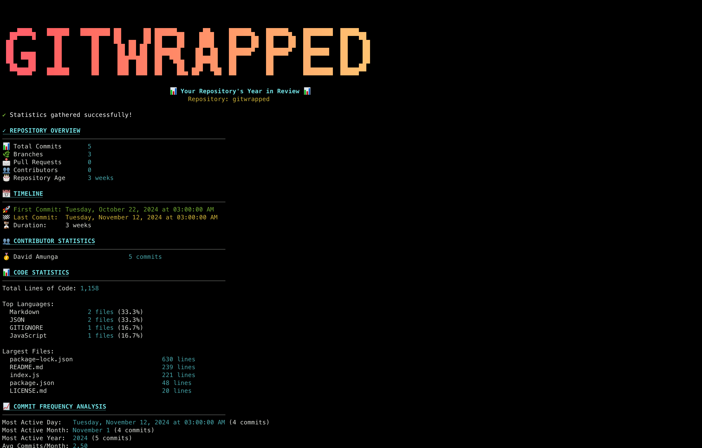

# 🎉 Git Wrapped

Your repository's year in review - a beautiful CLI tool to visualize your Git statistics!

<div align="center">

[](https://www.npmjs.com/package/gitwrapped)
[](https://opensource.org/licenses/MIT)



</div>

## ✨ Features

### 📊 Comprehensive Statistics

- **Repository Overview**

  - Total commits, branches, pull requests, and contributors
  - Repository age and activity timeline
  - First and last commit dates with duration

- **Contributor Insights**

  - Top contributors with commit counts
  - Ranked leaderboard with medals 🥇🥈🥉

- **Code Analysis**

  - Total lines of code across your repository
  - Programming language breakdown (top 5 languages)
  - Largest files by line count
  - Most frequently changed files (file churn)

- **Time-Based Analytics**

  - Most active hour, day, month, and year
  - Commits by time of day (4-hour blocks)
  - Weekend warrior stats (weekend vs weekday commits)
  - Commits by day of week with visual bars

- **Commit Streaks** 🔥

  - Current streak tracking
  - Longest streak ever with dates
  - Total active days
  - Streak achievements (Week Warrior, Month Master, Century Club, Year Legend)

- **Commit Patterns**

  - Average commit size (files changed, insertions, deletions)
  - Commit frequency analysis
  - Average commits per day and month

- **Fun Facts & Achievements** 🎊
  - MVP contributor
  - Night owl detection (commits after midnight)
  - Early bird detection (commits before 8 AM)
  - Code size milestones
  - And more surprises!

### 🎨 Beautiful Output

- Stunning ASCII art banner with gradient colors
- Color-coded sections for easy reading
- Progress indicators and spinners
- Visual bar charts for time-based data
- Clean, organized layout

### 🔧 Flexible Options

- **Year filtering**: Focus on a specific year (e.g., `--year 2025`)
- **Minimal mode**: Condensed output for quick overview
- **No emoji mode**: Clean output without emojis
- **Verbose mode**: Debug information for troubleshooting

## 🚀 Installation

### Global Installation (Recommended)

```bash
npm install -g gitwrapped
```

### Run Without Installing

```bash
npx gitwrapped
```

### Local Development

```bash
npm link
```

## 📖 Usage

### Basic Usage

Navigate to any Git repository and run:

```bash
gitwrapped
```

### Advanced Usage

```bash
# Filter by specific year
gitwrapped --year 2025

# Show all-time statistics (default)
gitwrapped --all-time

# Minimal output (condensed view)
gitwrapped --minimal

# Disable emojis
gitwrapped --no-emoji

# Combine options
gitwrapped --year 2024 --minimal

# Debug mode
gitwrapped --verbose

# Show help
gitwrapped --help
```

## 🎯 Examples

### Example 1: Your Personal Blog

```bash
cd ~/projects/my-blog
gitwrapped --year 2025
```

Output includes your 2025 coding activity, streaks, most active times, and achievements!

### Example 2: Team Project

```bash
cd ~/work/team-project
gitwrapped
```

See the full history with all contributors, commit patterns, and code statistics.

### Example 3: Quick Check

```bash
cd ~/projects/side-project
gitwrapped --minimal
```

Get a quick overview without all the details.

## 📊 Sample Output

See the beautiful output in action! Git Wrapped provides a comprehensive, color-coded visualization of your repository statistics:


The output includes:
- 🎨 Stunning ASCII art banner with gradient colors
- 📊 Repository overview with key metrics
- 📅 Timeline of your project's history
- 👥 Contributor leaderboard
- 💻 Code statistics and language breakdown
- 📈 Commit frequency analysis
- ⏰ Time-based insights (most active hours, days)
- 🔥 Commit streaks and achievements
- 🎉 Fun facts about your coding patterns

## 🛠️ Requirements

- Node.js 14.x or higher
- Git repository with at least one commit
- Unix-based system (macOS, Linux) or Windows with Git Bash

## 📦 Dependencies

Git Wrapped uses these awesome packages:

- `chalk` - Terminal styling
- `boxen` - Beautiful boxes
- `gradient-string` - Gradient colors
- `ora` - Elegant spinners
- `cli-progress` - Progress bars
- `asciichart` - ASCII charts
- `commander` - CLI framework

## 🤝 Contributing

Contributions are welcome! Feel free to:

1. Fork the repository
2. Create your feature branch (`git checkout -b feature/amazing-feature`)
3. Commit your changes (`git commit -m 'Add some amazing feature'`)
4. Push to the branch (`git push origin feature/amazing-feature`)
5. Open a Pull Request

## 📝 License

MIT © [David Amunga](https://github.com/DavidAmunga)

## 🌟 Show Your Support

If you like this project, please give it a ⭐️ on [GitHub](https://github.com/DavidAmunga/gitwrapped)!

## 🔗 Links

- [npm Package](https://www.npmjs.com/package/gitwrapped)
- [GitHub Repository](https://github.com/DavidAmunga/gitwrapped)
- [Report Issues](https://github.com/DavidAmunga/gitwrapped/issues)

## 💡 Inspired By

Spotify Wrapped - but for your code! 🎵 → 💻

---

Made with ❤️ by developers, for developers.
